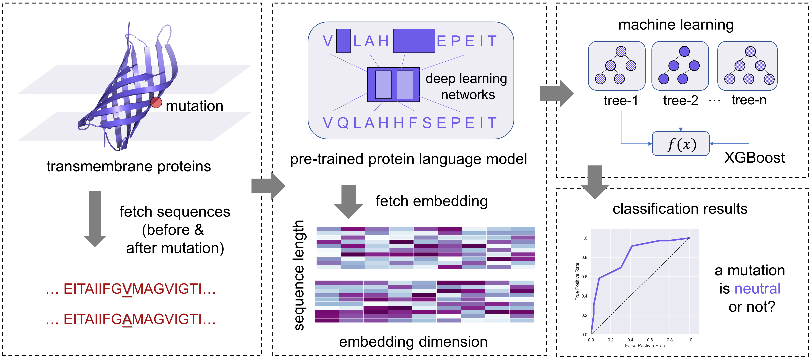

# MEMO-stab
MEMO-stab: Sequence-based Annotation of Mutation Effect on Transmembrane Protein Stability with Protein Language Model-Driven Machine Learning

<p align="center"></p>

## Environment
- Python >= 3.6
- Numpy == 1.24.1
- XGBoost == 1.7.1

## Download data of MEMO-stab
We provide the [training set](datasets/annotation/train_stab.fasta) and the [test set](datasets/annotation/test_stab.fasta) used in this study.

## Quick start

### Trained model download (XGBoost models)
|Model|Resource|Model|Resource|
|:---:|:---:|:---:|:---:|
|Esm2_t6|[Download](model/MEMO_stab_models/XGB-Esm2_t6.pickle)|Esm2_t30|[Download](model/MEMO_stab_models/XGB-Esm2_t30.pickle)
|KeAP|[Download](model/MEMO_stab_models/XGB-KeAP.pickle)|TAPE|[Download](model/MEMO_stab_models/XGB-TAPE.pickle)
|ProtBert|[Download](model/MEMO_stab_models/XGB-ProtBert.pickle)|ProtBert-BFD|[Download](model/MEMO_stab_models/XGB-ProtBert-BFD.pickle)
|ProtT5-XL-UniRef50|[Download](model/MEMO_stab_models/XGB-ProtT5-XL-UniRef50.pickle)|ProtT5-XL-BFD|[Download](model/MEMO_stab_models/XGB-ProtT5-XL-BFD.pickle)

### Prepare your own dataset

Step 1. Generate the embedding of the pre-trained protein language model, save as **embedding['seq_before']** and **embedding['seq_after']** (Numpy array with dimension: sample_number × padding_dim × protein_embedding_dim).

|Model|Embedding dim|Resource|Model|Embedding dim|Resource|
|:---:|:---:|:---:|:---:|:---:|:---:|
|Esm2_t6|320|[Ref link]()|Esm2_t30|640|[Ref link]()
|KeAP|1024|[Ref link]()|TAPE|768|[Ref link]()
|ProtBert|1024|[Ref link]()|ProtBert-BFD|1024|[Ref link]()
|ProtT5-XL-UniRef50|1024|[Ref link]()|ProtT5-XL-BFD|1024|[Ref link]()

Step 2. Flatten the arrays and feed them into the model.
```
> sample_list = []
> for i in range(your_sample_number):
>     feature_list = []
>     feature_list += embedding['seq_before'][i].flatten().tolist()
>     feature_list += embedding['seq_after'][i].flatten().tolist()
>     sample_list.append(feature_list)
> X_train = np.array(sample_list) # than feed 'X_train' to the trained XGBoost model
```

Note: 
- Make sure the mutation site is within the sequence input range of 512AA (padding_dim = 512).